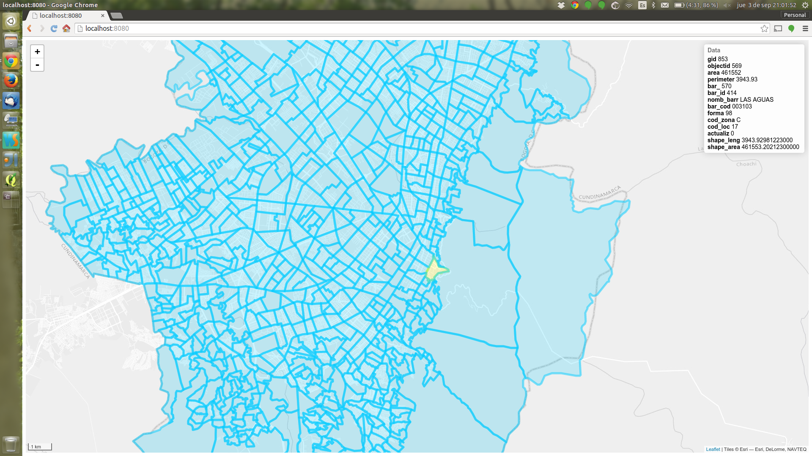

# Project Setup
## Prerequisites
```
### Create project folder
mkdir -p [pathToProjectFolder]
cd [pathToProjectFolder]
### Install NodeJS Modules
npm install geotabuladb express socket.io
```
You can use the npm '-g' option if you want to install NodeJS modules globally so it is set up for all projects.
```
npm install -g geotabuladb express socket.io
```
Then, you can link specific modules to your project or define the NODE_PATH environment variable:
```
# To link specific modules:
npm link geotabuladb express socket.io

# To set the NODE_PATH environment variable for the current user:
export NODE_PATH='/usr/local/lib/node_modules'

# To permanently set the NODE_PATH environment variable:
echo "export NODE_PATH='/usr/local/lib/node_modules'" >> ~/.bashrc
```
## Database
For this example, we are going to use the barrios_catrastales shape available [here] (https://sites.google.com/site/seriescol/shapes). The file available in the [data](data) folder has been transformed to use the WGS84 coordinate system. The following steps show how import the shape file to the database:
```
unzip barrios_catastrales_wgs84.zip
shp2pgsql barrios_catastrales_wgs84.shp > barrios_catastrales.sql
psql -U geotabula -d geotabula -f barrios_catastrales.sql
```
# Project Template
A basic NodeJS application has two files and two folders:

- *index.js:* This file contains the NodeJS code that runs in the server.
- *index.html:* This is the html file served to the client.
- *public folder:* The files in this folder are available to the client. This is the place to put client-side JavaScript and CSS files.
- *node_modules folder:* This folder contains the NodeJS npm locally installed or linked modules.

To manage the client-side application, we have four additional JavaScript files and one CSS file:

- public/js/*globals.js*: This file contains the global variables used by both server and client.
- public/js/*actions.js*: This file contains the functions/commands to manage the client-server socket communication.
- public/js/*map.js*: This file contains the map interaction functions.
- public/js/*support.js*: This file contains support code that is not directly related with interaction nor communication.
- public/css/*viewer.css*: This file contains the CSS styles that will be applied to the objects by the JavaScript events.

# Proposed Structure
The general structure for the JavaScript files is:

1. Imports: Libraries and Globals.
2. Script/Initialization: Instructions to run when the script is loaded (by the server or the client).
3. Functions: The functions to be called on specific events.

# Additional Comments
- Be aware that JavaScript does not provide a standard way to manage imports. In this example, we use the require() method for the server side and the script tag in the head of index.html for the client side. For a large project, it would be better to use libraries like [Browserify](http://browserify.org/) or [Webpack](http://webpack.github.io/) or frameworks like [Meteor](https://www.meteor.com/).
- Leaflet does not allow you to directly set the class name of a spatial object (for example, to apply a CSS style). In this tutorial, we use a workaround to convert the actual CSS style into a valid JavaScript object, thus it can be applied to spatial object (support.js).

# Project Screenshot



